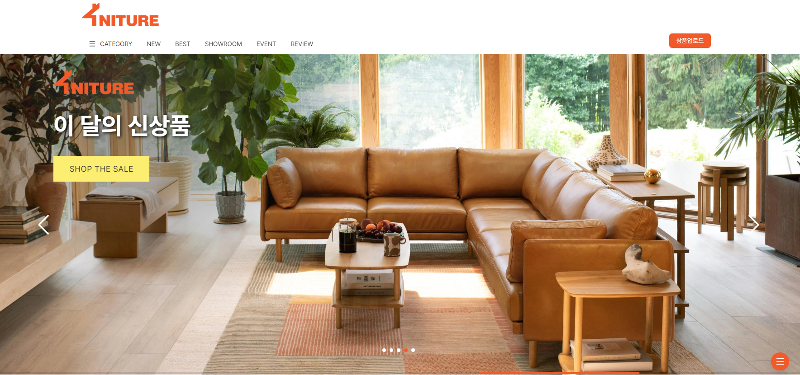

# 4NITURE 리엑트-풀스텍 프로젝트

## 배포주소

1. 🏠프론트 개발: [https://4urniture-react.vercel.app/](https://4urniture-react.vercel.app/)

2. 🏢서버 호스팅 주소: [https://port-0-furnitureserver-nx562olfdt8jh2.sel3.cloudtype.app/](https://port-0-furnitureserver-nx562olfdt8jh2.sel3.cloudtype.app/)

3. 🚀프론트 git : [https://github.com/hejo47/4urniture_react/tree/main](https://github.com/hejo47/4urniture_react/tree/main)

4. 🚀백엔드 git :[https://github.com/naehyun25/4niture_server.git](https://github.com/naehyun25/4niture_server.git)

## 개발기간

    2023/03/07~2023/03/29

## 기술 스택

### Environment

 

### Config

### Development

| JavaScript |  React   |  Node   |   Pwa   |
| :--------: | :------: | :-----: | :-----: |
|   ![js]    | ![react] | ![node] | ![pwa1] |

### Communication

  

 

## 프로젝트 소개

이 프로젝트는 PWA 앱으로 제작된 **반응형 풀스택 프로젝트**입니다.  
프론트엔드는 **리액트**로 제작되었으며, 백엔드는 **Node.js의 Express 프레임워크**를 활용하여 서버를 구현하였습니다.  
데이터베이스는 Sequelize를 사용하여 관리합니다.  
이 프로젝트는 모바일과 데스크탑 모두에서 쉽게 사용할 수 있도록 반응형으로 제작되었습니다.  
사용자 친화적인 **PWA 앱**으로, 간단한 설정으로 모바일 기기에서도 쉽게 이용할 수 있습니다.
 

 

# 시작가이드

## Installation

### Front

    1.  $ git clone https://github.com/hejo47/4urniture_react.git
    2.  $ cd 4urniture_react.git
    3.  $ nvm use v.16.19.0
    4.  $ npx create-react-app .
    5.  $ npm i react-router-dom
    6.  $ npm i antd
    7.  $ npm install swiper
    8.  $ npm i axios
    9.  $ npm start

### Backs

    1. $ git clone https://github.com/naehyun25/4niture_server.git
    2. $ cd 4niture_server
    3. $ nvm use v.16.19.0
    4. $ npm init
    5. $ npm i nodemon
    6. $ npm i multer
    7. $ npm i sequelize
    8. $ npm i sqlite3
    9. $ npm start

## 구현 기능

### MainPage - react-router-dom

    각 섹션별 컴포넌트를 이용하여 구성.
    메인배너 SwiperSlide
    메인 New,Best 상품 데이터를 선별하여 출력.

### SubPage

    - 제품 상세 페이지
        데이터를 axios 사용하여 데이터베이스에서 불러오기.
        상품구매 탭 구현하여 구매시 수량감소 -> 품절처리.

    - 상품 업로드 페이지
         데이터베이스에 axios 사용하여 데이터베이스 추가하기.

    - 카테고리 페이지
        데이터 값중 일부를 추출하여 일치하는 것만 화면에 출력하기.

    - 리뷰, 리뷰업로드 페이지.
        리뷰를 업로드하면 리뷰 서버에 리뷰 등록.
        리뷰 데이터베이스를 불러와 리뷰 페이지를 구현.

 

## 배운 점

1. Vercel을 이용하여 React.js 애플리케이션을 배포하고 호스팅하는 방법을 배웠다.
2. React.js의 useEffect 훅을 이용하여 API 요청을 처리하고, 상태를 업데이트하는 방법을 배웠다.
3. Axios를 이용하여 서버와 통신하는 방법을 배울 수 있습니다.
4. React.js에서 컴포넌트 간 데이터 전달을 위해 props와 state를 사용하는 방법을 배울 수 있습니다.
5. React.js에서 조건부 렌더링과 리스트 렌더링을 구현하는 방법을 배울 수 있습니다. 

[js]: /images/stack/javascript.svg
[react]: /images/stack/react.svg
[node]: /images/stack/node.svg
[pwa1]: /images/stack/pwa1.svg
